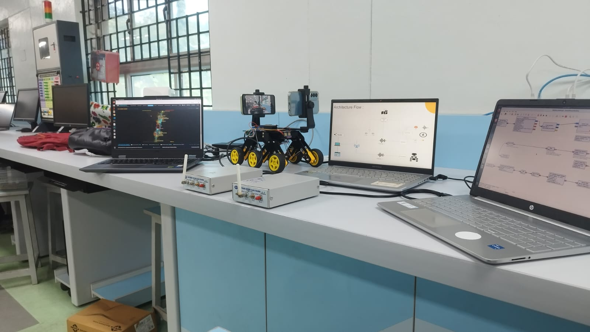
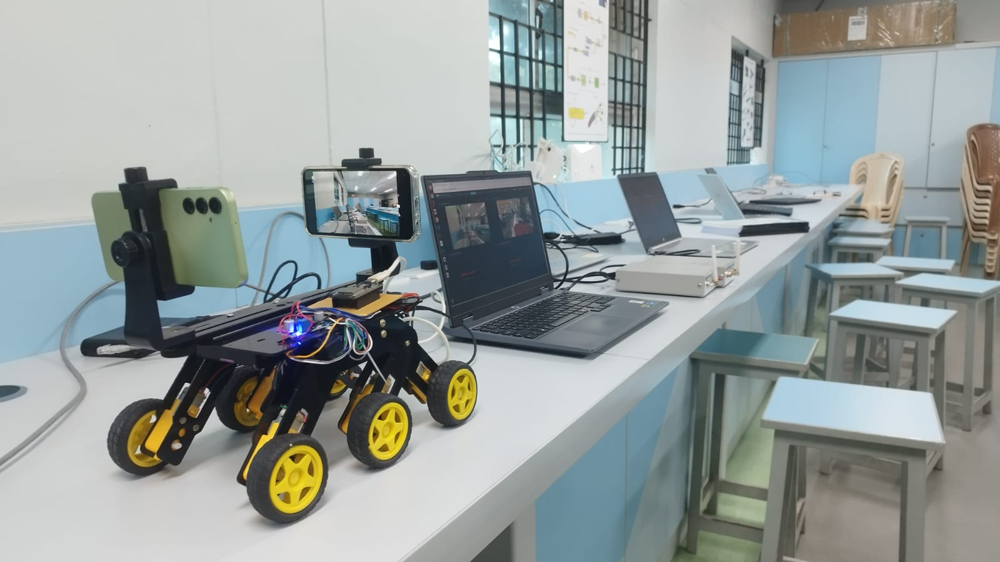
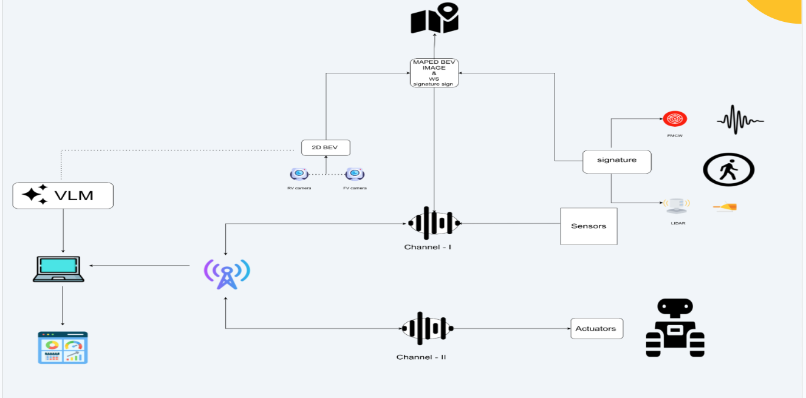
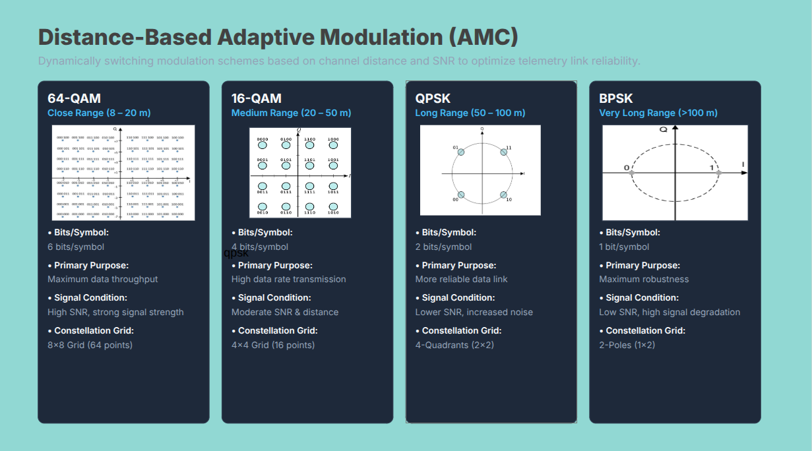
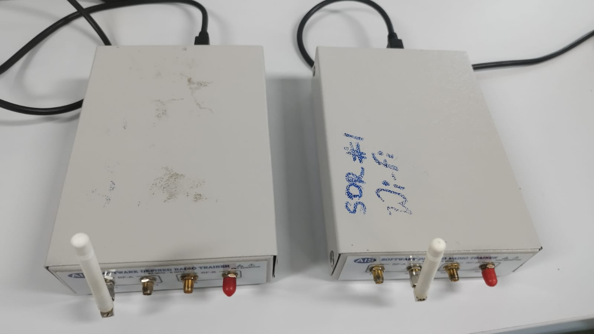
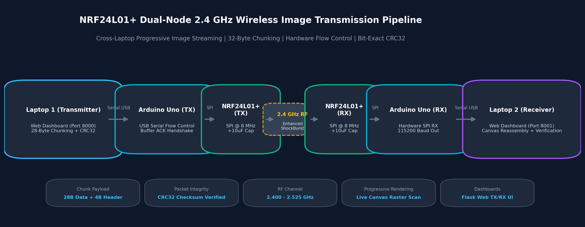
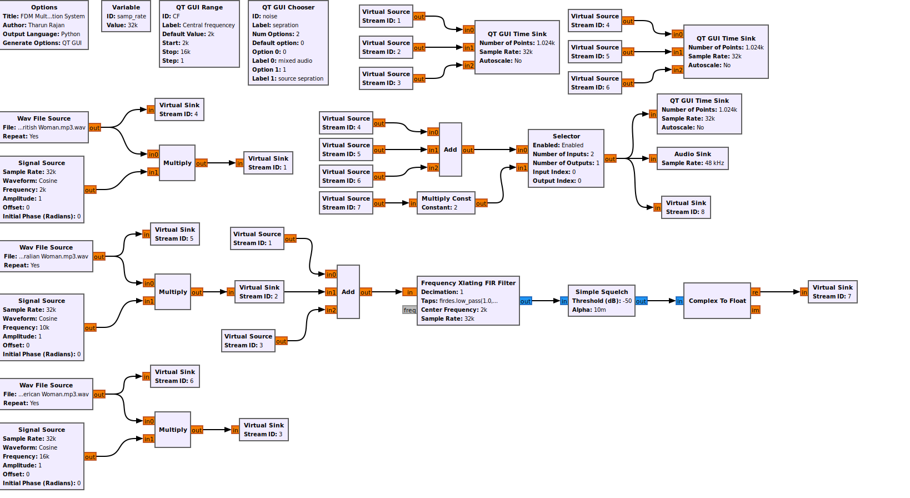

# Hi, I'm Tharun (@tharunrajan-11)

**Electronics and Communication Engineering Undergraduate | Exploring Electronics, RF, Embedded Systems & Emerging Technologies**

---

## Featured Project Highlights

### 1. Dual-Link UGV Smart Vision System & Wireless Sensing (SARA)

> **Repository**: [Dual-Link-UGV-Smart-Vision-System-and-Wireless-Sensing](https://github.com/tharunrajan-11/Dual-Link-UGV-Smart-Vision-System-and-Wireless-Sensing)

An autonomous 6-wheel rocker-bogie robotic rover platform combining surround-view multi-camera perception, real-time CUDA-accelerated 3D depth estimation, 24 GHz millimeter-wave radar tracking, and cognitive vision-language AI reasoning.

  
  

  

#### Key Highlights
- **Surround-View 360 BEV Stitching**: Dual-camera ground plane reconstruction using Inverse Perspective Mapping (IPM) and Euclidean distance-transform blending.
- **CUDA-Accelerated Metric Depth**: Dense 3D depth estimation (0-20 m range) powered by Depth Anything V2 operating at 60+ FPS on NVIDIA RTX GPU.
- **24 GHz mmWave FMCW Radar**: LD1125H millimeter-wave radar transceiver for all-weather obstacle ranging, Doppler velocity tracking, and chest micro-motion human presence sensing.
- **Cognitive Spatial AI & Voice**: Onboard spatial reasoning using quantized Qwen2.5-VL-3B-Instruct (4-bit NF4) paired with natural spoken voice alerts via Edge-TTS.
- **Live Cockpit Web Dashboard**: Zero-dependency real-time control cockpit displaying synchronized video streams, 2D occupancy vector grids, and radar polar plots over WebSockets.

---

### 2. TeleLink SDR Telemetry Transmitter (FMCW Radar & AMC)

> **Repository**: [TeleLink_trasnmitter-](https://github.com/tharunrajan-11/TeleLink_trasnmitter-)

A high-reliability Software-Defined Radio (SDR) telemetry transmission engine built with GNU Radio and Python, featuring dynamic distance-driven Adaptive Modulation & Coding (AMC) and physical bladeRF SDR hardware transport.

  
  

#### Key Highlights
- **Dynamic Adaptive Modulation (AMC)**: Autonomous constellation switching across BPSK, QPSK, 16-QAM, and 64-QAM based on channel SNR and target distance (up to 6.0 bps/Hz spectral efficiency).
- **Forward Error Correction (FEC)**: Rate 1/2 Convolutional Coder (K=7, [109, 79]) with CC_TAILBITING trellis providing ~5.5 dB coding gain without packet termination overhead.
- **Dual Output Transport**: Simultaneous physical over-the-air RF transmission via Nuand bladeRF 2.0 micro transceiver (600 MHz carrier) and complex64 ZeroMQ PUB/SUB network streaming.
- **Structured Radar Telemetry Frames**: Real-time packetization of 8-field telemetry frames (timestamp, range %, Doppler motion, presence confidence, radar status, environmental sensors).
- **Zero-Stall Pipeline Buffer**: Automatic 8-byte tagged stream padding preventing hardware buffer stalls during burst transmissions.

---

### 3. NRF24L01 Wireless Dual-Node Image Transmission

> **Repository**: [NRF24_Image_Transmission](https://github.com/tharunrajan-11/NRF24_Image_Transmission)

A complete cross-laptop 2.4 GHz wireless image transmission and progressive reassembly pipeline powered by dual Arduino Uno transceivers and dedicated interactive web dashboards.

  

#### Key Highlights
- **Cross-Laptop Dual-Node RF Link**: 2.4 GHz wireless transceiver communication bridging two Arduino Unos across two host laptops with Enhanced ShockBurst auto-acknowledgment.
- **Progressive Image Reassembly**: Live web canvas raster-scan rendering that progressively displays received image slices as 28-byte payload chunks arrive in real time.
- **Hardware Flow Control**: Serial ACK-handshake between Python host and microcontroller preventing serial buffer overruns during high-rate packet bursts.
- **100% Bit-Exact Verification**: 32-bit CRC checksum computed over source images and verified against reconstructed frames upon completion.
- **Dedicated Web Dashboards**: Standalone Transmitter UI (Port 8000), Receiver UI (Port 8001), and Unified Dual-Node Dashboard (Port 8080).

---

### 4. FDM Multi-Channel Audio Multiplexing & Extraction System

> **Repository**: [FDM-Multi-Channel-Audio-Multiplexing-System](https://github.com/tharunrajan-11/FDM-Multi-Channel-Audio-Multiplexing-System)

A real-time Software-Defined Radio (SDR) and Digital Signal Processing (DSP) framework in GNU Radio 3.10 and Python implementing Frequency Division Multiplexing (FDM) to transmit simultaneous multi-speaker audio across discrete subcarriers and selectively demultiplex individual voices.

  

#### Key Highlights
- **Frequency Division Multiplexing (FDM)**: Modulates multiple independent acoustic speech streams onto dedicated carrier channels (2.0 kHz, 10.0 kHz, 16.0 kHz) over a shared baseband medium.
- **Frequency Translating FIR Filter**: Simultaneously downconverts selected subcarriers directly to baseband (0 Hz) and applies narrow-band low-pass decimation in a single DSP block.
- **Squelch Gating & Coherent Demodulation**: Suppresses baseline noise fluctuations below -50 dB and normalizes output amplitude for clear acoustic reconstruction.
- **A/B Auditory Comparison Switch**: Interactive GUI switch toggling between raw mixed audio (simultaneous multi-speaker cocktail party) and clean extracted voice.
- **Real-Time PyQt5 Visualization**: Multi-channel oscilloscope time sinks displaying raw input speech, modulated carrier bands, and filtered output waveforms.

---

  <em>Developed by Tharun | Autonomous Mobile Robotics, Spatial AI, and Next-Generation Wireless Systems</em>

