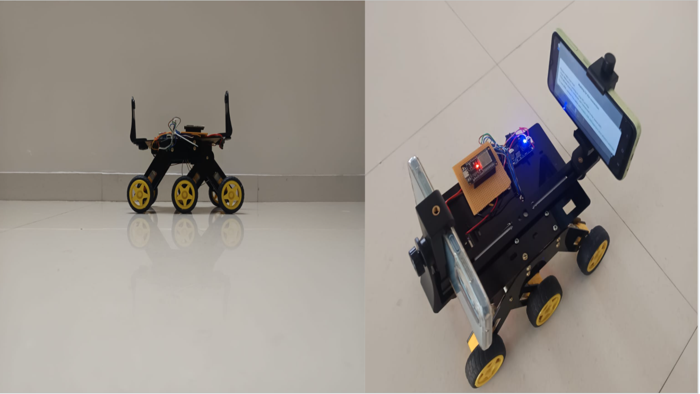
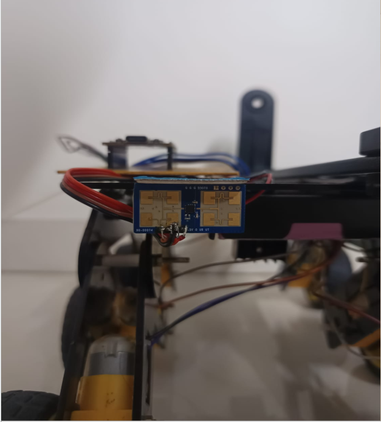

# Hi, I'm Tharun (@tharunrajan-11) 


[](https://github.com/tharunrajan-11)
[](https://www.python.org/)
[](https://isocpp.org/)
[](https://developer.nvidia.com/cuda-zone)
[](https://pytorch.org/)
[](https://www.gnuradio.org/)
[](https://www.nuand.com/bladerf-2-0-micro/)
[](https://www.ros.org/)

---

##  Featured Project: Dual-Link UGV Smart Vision System & Wireless Sensing (SARA)

> **Repository**: [github.com/tharunrajan-11/Dual-Link-UGV-Smart-Vision-System-and-Wireless-Sensing](https://github.com/tharunrajan-11/Dual-Link-UGV-Smart-Vision-System-and-Wireless-Sensing)

**SARA** (**S**patial **A**wareness & **R**easoning **A**gent) is a next-generation autonomous robotics, spatial perception, and wireless telemetry platform combining:

1. **Surround-View Perception & 3D Metric Depth**: Dual-camera Bird's-Eye View (BEV) ground stitching, **Depth Anything V2** (60+ FPS CUDA metric estimation), and 2D Semantic Occupancy Radar.
2. **Vision-Language Model (VLM) Reasoning**: Spatial reasoning, multi-modal obstacle assessment, and natural voice interaction (`Qwen2.5-VL-3B-Instruct` + `Edge-TTS`).
3. **24 GHz mmWave FMCW Radar & 6-Mode Graph Analytics Suite**: LD1125H millimeter-wave radar for high-precision obstacle ranging, Doppler velocity tracking, micro-motion human presence sensing, and multi-mission graph visualization.
4. **Adaptive Modulation & Coding (AMC) Wireless Sensing**: Dynamic Software-Defined Radio (SDR) telemetry transport supporting **BPSK, QPSK, 16-QAM, and 64-QAM** over ZeroMQ network streams or physical **bladeRF 2.0 micro** transceiver hardware.

<p align="center">
  
  <br>
  <em>Figure 1: Full System Laboratory Testbed: 6-Wheel Rocker-Bogie UGV with Dual-Phone Vision Rig, Web Dashboard, Software-Defined Radio Transceivers, and GNU Radio AMC Pipeline</em>
</p>

<p align="center">
  
  <br>
  <em>Figure 2: Physical 6-Wheel Rocker-Bogie UGV with Dual-Phone Surround-View Rig, Live Onboard Feeds, and Edge Compute Station</em>
</p>

---

### End-to-End System Architecture

<p align="center">
  
  <br>
  <em>Figure 3: End-to-End Perception, Multi-Sensor Processing, and Dual-Link Communication Architecture Flow</em>
</p>

| Subsystem | Technology Stack | Operational Role |
| :--- | :--- | :--- |
| **Surround Perception** | Dual Phone Cameras + IPM Homography | 360° ground plane reconstruction and distance-transform Euclidean feather blending. |
| **Dense 3D Depth** | Depth Anything V2 (ViT-Small / ViT-Large) | FP16 CUDA-accelerated metric depth estimation (0–20 m) operating at 60+ FPS. |
| **Semantic Mapping** | YOLOv8 + 2D Vector Occupancy Grid | Dynamic obstacle bounding boxes, 3-zone safety boundaries (Safe, Warning, Danger), and laser distance tethers. |
| **Cognitive Reasoning** | Qwen2.5-VL-3B-Instruct (4-bit NF4) | Onboard vision-language spatial reasoning, obstacle hazard evaluation, and navigation planning. |
| **Natural Voice Interaction** | Edge-TTS (AvaNeural) + GStreamer / Pygame | Natural spoken audio dialogue synthesizing navigational advice and threat alerts. |
| **mmWave Radar Sensing** | LD1125H 24 GHz FMCW Radar | All-weather obstacle ranging, Doppler velocity tracking, and sub-millimeter chest micro-motion human presence detection. |
| **Adaptive RF Telemetry** | GNU Radio + bladeRF 2.0 Micro / ZeroMQ | Distance-based Adaptive Modulation & Coding (BPSK, QPSK, 16-QAM, 64-QAM) with Rate 1/2 Convolutional FEC. |
| **Command & Control** | HTML5 / WebSocket / Canvas Web Dashboard | Zero-dependency real-time cockpit providing multi-stream video matrix, radar analytics, and live I/Q constellation visualizer. |

<p align="center">
  
  <br>
  <em>Figure 4: Dual-Camera Surround-View UGV Hardware Architecture with Front & Rear Phone Perception Rig</em>
</p>

---

### 24 GHz mmWave FMCW Radar Sensing
The UGV platform integrates an onboard **LD1125H 24 GHz mmWave Frequency-Modulated Continuous-Wave (FMCW)** radar transceiver for all-weather, low-visibility obstacle detection and physiological human presence sensing.

<p align="center">
  
  <br>
  <em>Figure 5: LD1125H 24 GHz mmWave FMCW Radar Planar Microstrip Patch Antenna Transceiver Array Mounted on UGV</em>
</p>

```
Transmitted Chirp:  f_tx(t) = f_c + (B / T_c) * t   (24.0 GHz - 24.25 GHz, B = 250 MHz)
Target Reflection:  f_rx(t) = f_tx(t - tau)         (Round-trip delay tau = 2R / c)
                                  │
                                  ▼
           [ Quadrature I/Q Homodyne Dechirping Mixer ]
                                  │
                                  ▼
           Intermediate Beat Frequency Tone:  f_b = (2 * B * R) / (c * T_c)
                                  │
            ┌─────────────────────┴─────────────────────┐
            ▼                                           ▼
 [ Fast-Time 1D-FFT (Range Profile) ]       [ Slow-Time 2D-FFT (Doppler Shift) ]
  Distance: R = (c * T_c * f_b) / (2 * B)    Velocity: f_d = (2 * v * f_c) / c
            │                                           │
            └─────────────────────┬─────────────────────┘
                                  ▼
 [ Sub-Millimeter Micro-Doppler Phase Tracker: Delta_phi = (4*pi*Delta_R) / lambda ]
  Detects human chest wall respiration (0.2 - 0.5 Hz) -> Presence Confidence (0 - 100%)
```

---

### Adaptive Modulation & Coding (AMC) SDR Telemetry Subsystem
The UGV incorporates an advanced Software-Defined Radio (SDR) telemetry transport link using the **Nuand bladeRF 2.0 micro** transceiver, dynamically switching modulation order and spectral efficiency in real time based on distance and Signal-to-Noise Ratio (SNR):

<p align="center">
  
  <br>
  <em>Figure 6: Distance-Based AMC Constellation Architecture & Dynamic Switching Thresholds</em>
</p>

| Range / Distance | Modulation Scheme | Bits / Symbol | Primary Purpose | Min Required SNR | Spectral Efficiency |
| :---: | :---: | :---: | :--- | :---: | :---: |
| **$> 5.0\text{ m}$ (Far)** | **BPSK** | $1\text{ bit}$ | Maximum link robustness, edge-of-range survival | $\ge 6\text{ dB}$ | $1.0\text{ bps/Hz}$ |
| **$3.0\text{ m} - 5.0\text{ m}$** | **QPSK** | $2\text{ bits}$ | Balanced throughput & noise resilience (Default) | $\ge 10\text{ dB}$ | $2.0\text{ bps/Hz}$ |
| **$1.5\text{ m} - 3.0\text{ m}$** | **16-QAM** | $4\text{ bits}$ | High-speed telemetry, point cloud streaming | $\ge 16\text{ dB}$ | $4.0\text{ bps/Hz}$ |
| **$< 1.5\text{ m}$ (Near)** | **64-QAM** | $6\text{ bits}$ | Maximum data rate, high-bandwidth sensor dumps | $\ge 22\text{ dB}$ | $6.0\text{ bps/Hz}$ |

<p align="center">
  
  <br>
  <em>Figure 7: Software-Defined Radio (SDR) Hardware Transceivers (Nuand bladeRF 2.0 micro & RTL-SDR v4) with 2.4 GHz FMCW Radar Testbed</em>
</p>

---

## 📡 Featured Project 2: TeleLink SDR Telemetry Transmitter (FMCW Radar & AMC)

> **Repository**: [github.com/tharunrajan-11/TeleLink_trasnmitter-](https://github.com/tharunrajan-11/TeleLink_trasnmitter-)

A high-reliability **Software-Defined Radio (SDR) telemetry transmission engine** engineered for real-time Frequency-Modulated Continuous-Wave (FMCW) radar telemetry and environmental wireless sensing.

TeleLink combines physical-layer **Forward Error Correction (FEC)**, dynamic distance-driven **Adaptive Modulation & Coding (AMC: BPSK, QPSK, 16-QAM, and 64-QAM)**, and dual transport backends (**ZeroMQ IPC streams** and physical **Nuand bladeRF 2.0 micro SDR** hardware).

```
[ FMCW Radar / Sensor Telemetry ]
               │
               ▼
[ 8-Field Telemetry Serialization & 8-Byte Stream Padding ]
               │
               ▼
[ Rate 1/2 Convolutional FEC Encoder (K=7, [109, 79], Tailbiting) ]
               │
               ▼
[ 32-bit Frame Sync Preamble (0xE15AE893) ]
               │
               ▼
[ AMC Modulator: BPSK / QPSK / 16-QAM / 64-QAM ]
[ Root-Raised Cosine (RRC) Pulse Shaping (sps=4, alpha=0.5) ]
               │
               ▼
[ 0.8x Peak Amplitude Scaling & IQStreamProbe (FFT / Constellation) ]
               │
        ┌──────┴──────┐
        ▼             ▼
 [ ZeroMQ PUB Sink ]   [ bladeRF SDR Sink ]
 (tcp://0.0.0.0:5001)  (600 MHz RF Carrier)
```

### TeleLink Adaptive Modulation & Coding (AMC) Matrix

| Range / Distance | Modulation Scheme | Bits / Symbol | Operational Purpose | Min Required SNR | Spectral Efficiency |
| :---: | :---: | :---: | :--- | :---: | :---: |
| **0 – 20 m** | **64-QAM** | **6** bits/sym | Maximum throughput (dense payload bursts) | $\ge 22 \text{ dB}$ | $6.0 \text{ bps/Hz}$ |
| **20 – 50 m** | **16-QAM** | **4** bits/sym | High-speed sensor telemetry | $\ge 15 \text{ dB}$ | $4.0 \text{ bps/Hz}$ |
| **50 – 100 m** | **QPSK** | **2** bits/sym | Standard robust wireless telelink (Default) | $\ge 8 \text{ dB}$ | $2.0 \text{ bps/Hz}$ |
| **> 100 m** | **BPSK** | **1** bit/sym | Maximum RF penetration & link survival | $< 8 \text{ dB}$ | $1.0 \text{ bps/Hz}$ |

### Key Capabilities:
- **Physical-Layer FEC**: Rate 1/2 Convolutional Encoder ($K=7, [109, 79]$) with `CC_TAILBITING` trellis eliminating zero-tail overhead and yielding $\approx 5.5\text{ dB}$ coding gain.
- **8-Byte Tagged Stream Padding**: Automatically space-pads tagged streams so payload byte lengths are exact multiples of 8, preventing pipeline buffer stalls.
- **Dual Output Sinks**:
  - **ZeroMQ PUB IPC (`tcp://0.0.0.0:5001`)**: Low-latency complex64 baseband distribution over LAN and Tailscale.
  - **bladeRF 2.0 micro SDR Sink (`soapy.sink`)**: Physical over-the-air transmission across 70 MHz to 6.0 GHz (600 MHz carrier) with software gain control (18 dB to 60 dB).
- **Structured 8-Field Radar Telemetry**: Packages `Date, Time, FMCW Distance (%), Target Motion, Presence (%), Radar Status, Temperature, Vibration` into structured telemetry frames.

---

## 📷 Featured Project 3: NRF24L01 Wireless Dual-Node Image Transmission

> **Repository**: [github.com/tharunrajan-11/NRF24_Image_Transmission](https://github.com/tharunrajan-11/NRF24_Image_Transmission)

A complete dual-node wireless image transmission and progressive reassembly system using **two NRF24L01+ 2.4 GHz transceivers**, **two Arduino Uno microcontrollers**, and dedicated **Web Dashboards** for Transmitter (Laptop 1) and Receiver (Laptop 2):

- **Progressive Reassembly**: Watch the received image render slice-by-slice as 28-byte chunks arrive.
- **Hardware Flow Control**: ACK-handshaking between Python host and Arduino to eliminate serial buffer overflows.
- **100% Bit-Exact Verification**: 32-bit CRC checksum guarantees received image matches the source.
- **Independent & Unified Dashboards**: Standalone Transmitter (Port 8000), Receiver (Port 8001), and Unified Dual-Node Dashboard (Port 8080).

---

## 📂 Quick Repository Index

| Repository | Focus Area | Key Technologies |
| :--- | :--- | :--- |
| **[Dual-Link-UGV-Smart-Vision-System-and-Wireless-Sensing](https://github.com/tharunrajan-11/Dual-Link-UGV-Smart-Vision-System-and-Wireless-Sensing)** | Robotics, BEV, VLM & Radar | Python, CUDA, Depth Anything V2, YOLOv8, Qwen2.5-VL, 24 GHz Radar |
| **[TeleLink_trasnmitter-](https://github.com/tharunrajan-11/TeleLink_trasnmitter-)** | SDR Telemetry & Adaptive Modulation | GNU Radio 3.10, bladeRF 2.0 micro, AMC (BPSK/QPSK/16QAM/64QAM), FEC |
| **[NRF24_Image_Transmission](https://github.com/tharunrajan-11/NRF24_Image_Transmission)** | 2.4 GHz RF Image Telemetry | NRF24L01+, Arduino Uno, C++, Flask, Progressive Image Reassembly |

---

<p align="center">
  <em>Developed by Tharun | Autonomous Mobile Robotics, Spatial AI, and Next-Generation Wireless Systems</em>
</p>
